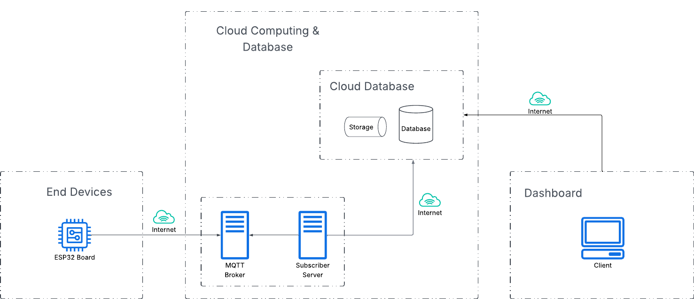

# 💻 UTS IF4051 Pengembangan Sistem IoT 💻 



## Deskripsi
Repository ini adalah implementasi dari UTS IF4051 Pengembangan Sistem IoT. Dashboard aplikasi dapat diakses melalui [link ini](https://uts-iot-13521132.vercel.app/).


## Instalasi
1. Clone repository ini ke dalam folder lokal Anda. 
    ```bash
    git clone https://github.com/dhanikanovlisa/if4051_13521132_uts_iot.git
    ```
2. Masuk ke dalam folder repository yang telah di-clone.
    ```bash
    cd if4051_13521132_uts_iot
    ```
3. Buat file `.env` di dalam folder `mqtt-subcriber` dengan isi sebagai berikut: 
    ```env
    # === Supabase Configuration ===
    SUPABASE_URL = 
    SUPABASE_KEY = 
    SUPABASE_BUCKET =

    # === MQTT Con
    MQTT_PORT = 1883
    MQTT_TOPIC =
    ```
3. Jalankan container docker untuk MQTT broker dan subscriber.
    ```bash
    docker-compose up -d
    ```
4. Masuk ke dalam folder `dashboard-uts-iot` untuk menjalankan aplikasi dashboard.
    ```bash
    cd dashboard-uts-iot
    pnpm install
    ```
5. Buat file `.env` di dalam folder `dashboard-uts-iot` dengan isi sebagai berikut: 
    ```env
    NEXT_PUBLIC_SUPABASE_URL=
    NEXT_PUBLIC_SUPABASE_ANON_KEY=
    ```
6. Jalankan aplikasi dashboard.
    ```bash
    pnpm run dev
    ```

    